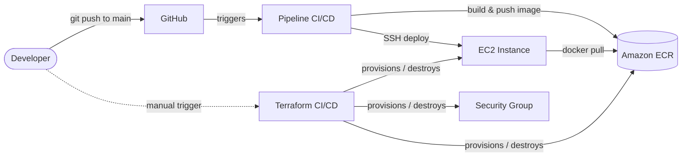

# AWS CI/CD Terraform Pipeline


A static website deployed to AWS with a fully automated CI/CD pipeline: infrastructure provisioned with Terraform, application packaged with Docker, and both workflows automated with GitHub Actions using short-lived, keyless AWS authentication (OIDC).

No AWS access keys are stored anywhere — not in the repo, not in GitHub Secrets. Every workflow run authenticates with a temporary token issued by GitHub and verified by AWS.

## Architecture



Two independent workflows, on purpose:
- **`terraform.yaml`** — manual only (`workflow_dispatch`). Creates or destroys infrastructure (EC2, Security Group, ECR repository). Infra changes should be deliberate, not automatic.
- **`deploy.yaml`** — automatic on every push to `main`. Builds the Docker image, pushes it to ECR, and redeploys it on the running EC2 instance.

## Tech stack

| Layer | Tools |
|---|---|
| Infrastructure as Code | Terraform (AWS provider) |
| Compute | Amazon EC2 (Amazon Linux 2023) |
| Container registry | Amazon ECR |
| Web server | Nginx (Docker, `nginx:alpine`) |
| CI/CD | GitHub Actions |
| AWS authentication | OIDC (GitHub ↔ AWS IAM, no static credentials) |
| State storage | Terraform remote backend on Amazon S3 |

## Repository structure

```
aws-cicd-terraform-pipeline/
├── app/                    # Application
│   ├── website/            # Static site (HTML/CSS/JS)
│   └── Dockerfile
├── infra/                  # Infrastructure as Code
│   ├── backend.tf          # Remote state (S3)
│   ├── provider.tf
│   ├── ec2.tf               # EC2 instance + Security Group
│   ├── ecr.tf               # Container registry
│   ├── variables.tf
│   └── user_data.sh         # Bootstrap script (installs Docker on first boot)
└── .github/workflows/
    ├── terraform.yaml       # Provision / destroy infrastructure (manual)
    └── deploy.yaml          # Build, push, and deploy the app (automatic)
```

## Security highlights

- **No long-lived AWS credentials.** GitHub Actions authenticates via OpenID Connect; AWS issues short-lived, per-run credentials to a tightly scoped IAM role.
- **Trust policies are locked to a single branch** (`ref:refs/heads/main`) and to this specific repository — no other repo or branch can assume these roles.
- **Least-privilege roles**: the role that builds/pushes images can't touch infrastructure, and the role that manages infrastructure can't push arbitrary images.
- **No hardcoded AWS account ID.** It's injected at runtime from a GitHub Actions repository variable.

## Getting started

To reproduce this project in your own AWS account:

1. **Create an OIDC identity provider** in IAM for `token.actions.githubusercontent.com` (audience `sts.amazonaws.com`).
2. **Create three IAM identities**, scoped to your fork of this repo:
   - `GitHubInfraRole` — used by `terraform.yaml`; needs EC2, ECR, and S3 (state bucket) access, plus `iam:PassRole` for the instance profile below.
   - `GitHubActionsRepoApp` — used by `deploy.yaml`; needs ECR push access.
   - `ECR-EC2-Role` — an EC2 instance profile with ECR read-only access.
3. **Create an S3 bucket** for Terraform state, matching the name in `infra/backend.tf`.
4. **Create an EC2 key pair** matching `key_name` in `infra/ec2.tf`.
5. **Set repository variables/secrets** in GitHub: `AWS_ACCOUNT_ID` (variable), `ADMIN_IP`, `INSTANCE_KEY`, `PUBLIC_IP` (secrets).
6. Run the **Terraform CI/CD** workflow with `apply = true`.
7. Copy the new EC2 public IP into the `PUBLIC_IP` secret.
8. Push to `main` (or re-run **Pipeline CI/CD**) to build and deploy the app.

## Challenges solved along the way

- **GitHub's OIDC token format changed mid-project** (July 2026): newly created repositories started sending an immutable, ID-based subject claim instead of the classic name-based one. Trust policies here support both formats so authentication keeps working regardless of when a repo was created.
- **Silent infrastructure failures**: an EC2 resource with no `user_data` reference boots successfully but never runs its bootstrap script — a failure that produces no error, only a missing dependency discovered later.
- **OS assumptions break automation**: a script written for Ubuntu (`apt-get`, user `ubuntu`) fails silently on Amazon Linux, which uses `dnf` and the `ec2-user` account.
- **Security Groups vs. hosted CI runners**: restricting SSH to a single static IP (a common local best practice) blocks GitHub-hosted runners entirely, since their IP changes on every run.
- **S3 native state locking** requires explicit permissions on a *second* object key (the `.tflock` companion file) — easy to miss if you only grant access to the state file itself.

## Acknowledgements & Reflections

My sincere thanks to [Maria Lazara](https://github.com/marialazara/laboratorio-devops), an amazing mentor with a deep understanding of DevOps, whose laboratory provided the foundation for this project. Her practical and accessible approach to teaching allowed me to explore DevOps concepts by actually building and troubleshooting a real-world workflow.

This project was a real roller coaster. It brought moments of great satisfaction, but also plenty of frustration while debugging and fixing unexpected issues. 😅 Every challenge, however, became an opportunity to understand the technologies more deeply and see how the different pieces of a DevOps workflow fit together in practice.

I'm already looking forward to working on similar projects and continuing to deepen my knowledge, especially in AWS, Terraform, Docker, and CI/CD. More than just getting the pipeline to work, this experience taught me how important troubleshooting, patience, and understanding the reasons behind each configuration really are.

It was challenging, sometimes frustrating, and definitely a lot of work — but I'm genuinely proud of completing it and of how much I learned along the way. 🦈

## License

This project is licensed under the [MIT License](./LICENSE).
